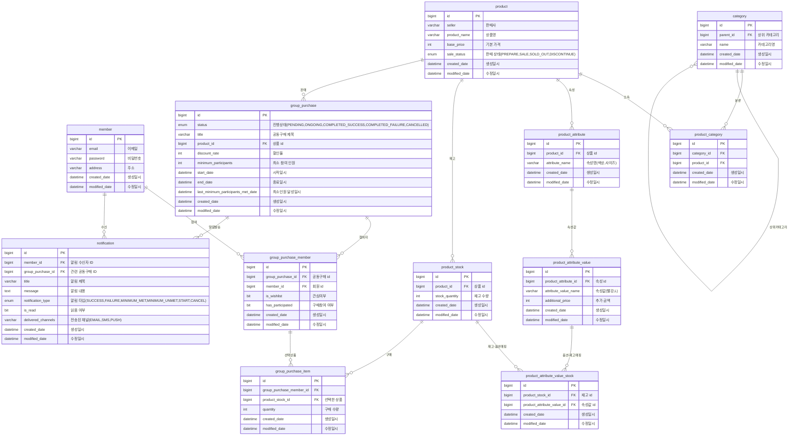
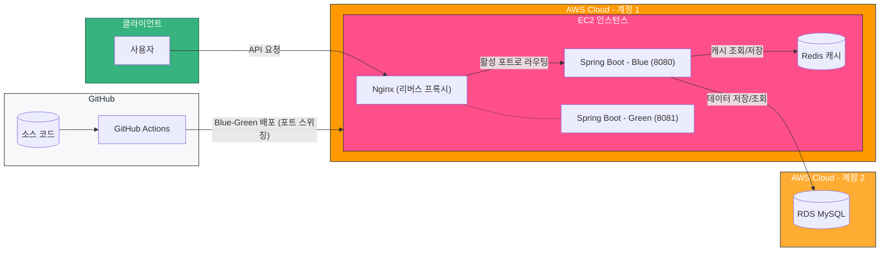

# Group-wise 공동구매 서비스
공동구매 서비스 api 서버 토이 프로젝트입니다.

## 사용 기술
- 백엔드: Spring Boot, Spring Security, JPA/Hibernate, QueryDSL
- 데이터베이스: MySQL, Flyway(마이그레이션)
- 캐시: Redis (Spring Cache Abstraction)
- 인프라/배포: AWS EC2/RDS, Nginx, GitHub Actions (Blue-Green 무중단 배포)
- 테스트: JUnit

## 프로젝트 목표


1. **Spring 기반 백엔드 애플리케이션 구현**
  - Spring Data JPA와 QueryDSL을 활용한 타입 안전 쿼리 구현
  - 복잡한 도메인 관계 매핑 및 효율적인 데이터 접근 패턴 적용
  - Flyway를 활용한 데이터베이스 마이그레이션 관리
  - AWS 환경 배포 및 GitHub Actions를 활용한 CI/CD 파이프라인 구축
2. **도메인 주도 설계(DDD) 접근 방식 적용**
  - 비즈니스 도메인 개념을 중심으로 엔티티 모델링
  - 애그리게이트 경계 설정을 통한 일관성 있는 도메인 설계
  - 도메인 모델을 통한 비즈니스 규칙 캡슐화
  - 도메인 이벤트를 활용한 시스템 간 느슨한 결합 구현
3. **보안 및 인증 체계 구현**
  - JWT 기반 사용자 인증 메커니즘 구축
  - Spring Security와 연계한 인증 필터 및 토큰 검증 구현
  - 권한 기반 API 접근 제어
4. **성능 및 안정성 개선**
  - Redis 캐싱을 통한 조회 성능 최적화 및 캐시 무효화 전략 적용
  - 배치 페칭(`default_batch_fetch_size`)을 통한 N+1 문제 완화
  - 비동기 이벤트 처리로 알림 발송이 핵심 트랜잭션에 영향을 주지 않도록 분리
  - Nginx 포트 스위칭 기반 Blue-Green 무중단 배포 구축

## 주요 기능 소개

1. **상품 및 재고 관리**
  - 다양한 상품 속성 및 옵션 구성 관리
  - 상품 재고 관리 및 구매 시 수량 조정
  - 상품 정보 CRUD 및 상태 관리
2. **공동구매 프로세스**
  - 공동구매 생성, 참여, 취소, 완료 등 핵심 비즈니스 흐름 구현
  - 최소 참여 인원 기반 공동구매 성공/실패 자동 처리
  - 할인율 기반 가격 정책 적용
  - 공동구매 상태에 따른 제약 조건 및 비즈니스 규칙 적용
3. **이벤트 기반 알림 시스템**
  - 공동구매 상태 변경 시 이벤트 발행 및 구독
  - 알림 메시지 생성 및 저장
  - 다양한 알림 채널 지원을 위한 확장 구조 설계
4. **사용자 인증 및 기본 관리**
  - JWT 기반 사용자 인증
  - 회원 가입 및 기본 정보 관리
  - 공동구매 참여 및 관심 표시 기능

## 중점적으로 고민했던 기술 요소와 해결

### 도메인 모델 캡슐화와 경계 설정
애그리게이트 간 경계를 명확히 하고 내부 구현을 은닉하는 과정에서, 코드의 복잡성과 유지보수성 사이의 균형을 고민했습니다. Product와 GroupPurchase 도메인에서 외부에서 직접 접근을 제한하면서도 필요한 기능은 제공할 수 있도록 Protected 접근 제어자와 메서드 설계에 신경썼습니다.

### 복잡한 비즈니스 규칙의 우아한 구현
공동구매 서비스의 핵심인 '조건부 상태 변경' 로직(최소 인원 달성 여부에 따른 성공/실패 처리)을
도메인 모델 내에 캡슐화했습니다. 외부 서비스나 스케줄러는 단순히 `complete()` 메소드만 호출하고,
실제 상태 전이 로직과 후속 처리는 도메인 객체가 스스로 결정하는 객체지향적 설계를 구현했습니다.

### QueryDSL과 Java Stream API의 적절한 활용 지점 결정
복잡한 검색 조건과 정렬을 구현하는 과정에서, 모든 로직을 QueryDSL에 집중시키는 것과 일부 처리를 서비스 레이어의 Java 코드로 분산시키는 것 사이의 균형점을 고민했습니다. 특히 `GroupPurchaseRepositoryImpl`에서는 기본적인 필터링은 QueryDSL로 처리하되, 복잡한 계산이 필요한 정렬 조건(남은 시간, 참여율 등)은 서비스 레이어에서 Java Stream API로 처리하는 방식을 채택했습니다. 이 접근 방식은 코드 가독성과 유지보수성을 높이는 효과가 있었습니다.

```java
// Repository에서 기본 필터링
@Override
public List<GroupPurchase> searchGroupPurchases(GroupPurchaseSearchRequest searchRequest) {
   JPAQuery<GroupPurchase> contentQuery = queryFactory
           .selectFrom(groupPurchase)
           .where(createWhereCondition(searchRequest));
   // 단순 정렬만 적용
   return contentQuery.fetch();
}

// Service에서 복잡한 정렬 로직 처리
private void sortByRemainingTime(List<GroupPurchase> results, SortDirection direction) {
   LocalDateTime now = LocalDateTime.now();
   Comparator<GroupPurchase> comparator = Comparator.comparing(
           gp -> Duration.between(now, gp.getEndDate()).getSeconds()
   );
   if (direction == SortDirection.DESC) {
      comparator = comparator.reversed();
   }
   results.sort(comparator);
}
```

### 이벤트 기반 시스템 설계
공동구매 상태 변경 시 알림 발송, 주문 생성 등 여러 후속 처리가 필요한 상황에서, 각 서비스 간 직접적인 의존성을 줄이기 위해 이벤트 기반 아키텍처를 적용했습니다. GroupPurchaseService는 상태 변경 시 해당 이벤트만 발행하고, 실제 처리는 각 이벤트 리스너가 담당하는 구조입니다. 이를 통해 서비스 간 결합도를 낮추고, 새로운 기능 추가 시 기존 코드 수정 없이 새 리스너만 추가하는 확장성을 확보했습니다. 또한 각 서비스가 자신의 핵심 책임에만 집중할 수 있어 코드의 응집도도 향상되었습니다.
```java
// 이벤트 발행 (GroupPurchaseSchedulerService)
if (newStatus == Status.COMPLETED_SUCCESS) {
        eventPublisher.publishSuccessEvent(new GroupPurchaseSuccessEvent(this, groupPurchase));
}

// 이벤트 구독 (GroupPurchaseEventListener)
@EventListener
public void handleGroupPurchaseSuccessEvent(GroupPurchaseSuccessEvent event) {
   GroupPurchase groupPurchase = event.getGroupPurchase();
   // 알림 발송 로직
}
```

### 트랜잭션 경계를 고려한 비동기 알림 처리
알림 발송이 공동구매 상태 변경 트랜잭션의 성능과 성공 여부에 영향을 주지 않도록, 이벤트 리스너를 비동기로 전환했습니다. 이 과정에서 다음과 같은 문제들을 고민하고 해결했습니다.

- **트랜잭션 실행 단계 제어**: `@TransactionalEventListener(phase = AFTER_COMMIT)`을 적용해, 트랜잭션이 커밋되기 전에 알림이 발송되는 문제(롤백 시 잘못된 알림 발송)를 방지했습니다.
- **전용 스레드 풀 구성**: 기본 `SimpleAsyncTaskExecutor`는 요청마다 새 스레드를 생성하므로, 알림 전용 `ThreadPoolTaskExecutor`(core 5 / max 15 / queue 100)를 구성했습니다. 큐 포화 시에는 `CallerRunsPolicy`로 호출 스레드가 직접 처리하게 하여 작업 유실을 방지하고 자연스러운 백프레셔를 확보했습니다.
- **다수 참여자 알림 병렬화**: 참여자 수에 비례해 발송 시간이 늘어나는 문제를 병렬 스트림으로 개선했습니다.
- **LazyInitializationException 해결**: 비동기 리스너와 스케줄러는 원본 트랜잭션의 영속성 컨텍스트 밖에서 실행되므로, 지연 로딩 시점 문제로 발생한 `LazyInitializationException`을 트랜잭션 범위와 데이터 조회 시점을 조정하여 해결했습니다.

```java
@Async("notificationTaskExecutor")
@TransactionalEventListener(phase = TransactionPhase.AFTER_COMMIT)
public void handleGroupPurchaseStartedEvent(GroupPurchaseStartedEvent event) {
    GroupPurchase groupPurchase = event.getGroupPurchase();
    Map<Boolean, Long> results = groupPurchase.getWishlistIds().parallelStream()
        .map(wishlistId -> notificationService.notify(
            Notification.createStartNotification(...)))
        .collect(Collectors.groupingBy(result -> result, Collectors.counting()));
}
```

### Redis 캐싱을 통한 조회 성능 개선
상품 상세 조회는 속성·속성값·재고 조합까지 여러 연관 엔티티를 조회하는 비용이 큰 작업이지만 변경 빈도는 낮다는 점에 착안해, Spring Cache Abstraction 기반 캐싱을 적용했습니다.

- **조회 캐싱 / 무효화 전략**: 조회 메서드에 `@Cacheable`, 상품 정보·재고를 변경하는 모든 메서드에 `@CacheEvict`를 적용해 캐시 정합성을 유지했습니다.
- **로컬 캐시에서 Redis로 전환**: 초기에는 `ConcurrentMap` 기반 로컬 캐시로 시작했지만, 다중 인스턴스 환경(Blue-Green 배포로 두 프로세스가 공존)에서 인스턴스별 캐시 불일치 문제가 발생할 수 있어 Redis 중앙 캐시 저장소로 전환했습니다.
- **TTL과 직렬화**: 무효화 누락에 대비해 TTL(10분)을 설정하고, `GenericJackson2JsonRedisSerializer`로 DTO를 JSON 직렬화하여 저장했습니다.

```java
@Bean
public CacheManager cacheManager(RedisConnectionFactory factory) {
    RedisCacheConfiguration config = RedisCacheConfiguration
            .defaultCacheConfig()
            .entryTtl(Duration.ofMinutes(10))
            .serializeValuesWith(SerializationPair.fromSerializer(
                new GenericJackson2JsonRedisSerializer()));
    return RedisCacheManager.builder(factory).cacheDefaults(config).build();
}
```

### 배치 페칭을 통한 N+1 문제 완화
모든 연관관계를 `FetchType.LAZY`로 유지하면서, 글로벌 설정 `default_batch_fetch_size: 100`을 적용해 지연 로딩 시 발생하는 N+1 쿼리를 `IN` 절 기반 배치 조회로 묶었습니다. 페치 조인으로 개별 쿼리를 일일이 최적화하는 대신, 컬렉션 조회가 많은 도메인 특성(상품, 속성, 속성값, 재고 조합)에 맞춰 전역 배치 페칭으로 일관된 개선 효과를 얻는 방식을 선택했습니다.

### Nginx 포트 스위칭 기반 Blue-Green 무중단 배포
단일 EC2 인스턴스 환경에서 배포 중 서비스 중단이 발생하는 문제를 해결하기 위해, GitHub Actions와 Nginx를 활용한 Blue-Green 배포를 구축했습니다.

1. 현재 서비스 중인 포트(8080/8081)를 확인하고, 유휴 포트에 새 버전을 기동
2. 새 버전의 기동 완료를 헬스체크(`nc`)로 확인
3. Nginx 리버스 프록시 대상 포트를 새 버전으로 전환(`nginx reload`)
4. 이전 버전 프로세스 종료

이를 통해 배포 시점에도 사용자 요청이 중단 없이 처리되고, 새 버전 기동 실패 시 기존 버전이 그대로 서비스를 유지하는 안전장치를 확보했습니다.

### 제네릭 프로그래밍을 통한 유연한 유틸리티 개발
상품의 다양한 옵션 조합을 생성하는 과정에서, 타입 안전성과 재사용성을 모두 확보하기 위해 제네릭 프로그래밍 기법을 적용했습니다. ListUtils 클래스의 데카르트 곱 계산 알고리즘은 다양한 타입에 적용 가능하도록 설계했습니다.
```java
public static <V> List<List<V>> cartesianProduct(List<? extends ContainerOfValues<V>> listOfContainer) {
// 데카르트 곱 알고리즘 구현
}
```

### 현대적 Java 기능 활용
Java 14+ 레코드 기능을 활용하여 DTO를 간결하고 명확하게 설계했습니다. 이를 통해 데이터 전송 객체의 불변성을 보장하고 보일러플레이트 코드를 최소화했습니다.
```java
public record GroupPurchaseDetailResponse(
    long id,
    String title,
    // ... 필드들
) {
    // 필요한 메서드만 추가
}
```

### Spring Security 통합 및 JWT 인증
토큰 기반 인증 메커니즘을 Spring Security와 통합하는 과정에서, 코드 중복을 최소화하고 보안 정책을 중앙화하기 위해 JwtTokenProvider 클래스를 설계했습니다. 이를 통해 인증 로직의 응집도를 높이고 유지보수성을 개선했습니다.

### 데이터 컨버터를 활용한 다중 값 처리 최적화
Notification 엔티티의 deliveredChannels 필드 설계에서, 알림 채널(EMAIL, SMS, PUSH 등)을 저장하기 위해 별도의 테이블을 사용하는 대신 JPA 컨버터를 활용하는 접근 방식을 선택했습니다. 이를 통해 엔티티 모델에서는 Set<DeliveryChannel> 형태로 사용하면서도, 데이터베이스에는 단일 컬럼에 쉼표로 구분된 문자열로 저장하여 스키마 단순화와 조회 성능을 모두 확보했습니다.
```java
@Convert(converter = DeliveryChannelSetConverter.class)
private Set<DeliveryChannel> deliveredChannels;

// 컨버터 구현
@Override
public String convertToDatabaseColumn(Set<DeliveryChannel> attribute) {
if (attribute == null || attribute.isEmpty()) {
return null;
}
return attribute.stream()
.map(DeliveryChannel::name)
.collect(Collectors.joining(DELIMITER));
}
```

## 향후 개선 계획

### Redis 분산락을 활용한 재고 차감 동시성 제어 *(도입 예정)*
공동구매 참여 시 재고 차감 로직은 현재 단일 트랜잭션 내에서 처리되고 있어, 다중 인스턴스 환경에서 동시 참여 요청이 몰릴 경우 재고가 초과 차감될 수 있는 동시성 문제(race condition)가 존재합니다. 이를 해결하기 위해 다음 방안을 학습하고 비교 중입니다.

- **비관적 락 (`SELECT ... FOR UPDATE`)**: 구현이 단순하지만 DB 커넥션을 점유한 채 대기하므로, 인기 공동구매에 트래픽이 집중되는 서비스 특성상 커넥션 풀 고갈 위험이 있음
- **낙관적 락 (`@Version`)**: 충돌이 드물 때 유리하지만, 마감 임박 시점처럼 충돌이 빈번한 상황에서는 재시도 비용이 커짐
- **Redis 분산락 (Redisson)**: DB 부하 없이 애플리케이션 레벨에서 임계 영역을 제어할 수 있고, 이미 캐시 용도로 Redis를 운영 중이므로 인프라 추가 비용 없이 도입 가능. pub/sub 기반 락 대기(Redisson `RLock`)로 스핀락 방식의 부하 문제도 회피

현재는 캐시 저장소로 도입한 Redis를 분산락까지 확장 적용하여, 트래픽이 집중되는 참여/재고 차감 구간의 정합성을 보장하는 방향으로 개선을 진행할 계획입니다.

## ERD 다이어그램



## 배포 구성도


